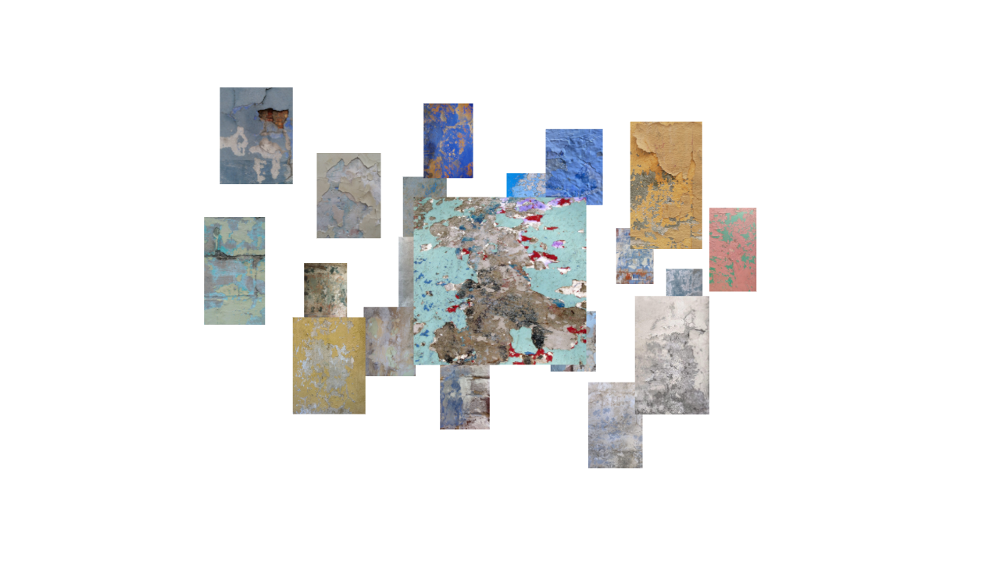

# 3Dgallery — rebuild study

Studio di ricostruzione 1:1 della digital exhibition **Foam Talent 2024**
([foam.org/talent-2024](https://www.foam.org/talent-2024)): una nuvola 3D di
fotografie navigabile in orbita, con intro tipografica, hover, focus con volo
di camera e sfondo colorato per opera. Le fotografie vengono da `public/img`,
che è l'unica fonte di verità: cambi i file lì e il progetto si riallinea da
solo al prossimo dev/build.



## Stack

Lo stesso del sito originale, verificato nei suoi bundle di produzione:

- [three.js](https://threejs.org) r160 + [@react-three/fiber](https://github.com/pmndrs/react-three-fiber)
- [@react-three/drei](https://github.com/pmndrs/drei) (`OrbitControls`)
- [framer-motion](https://www.framer.com/motion/) 10.18 + framer-motion-3d
- [@use-gesture/react](https://use-gesture.netlify.app)
- Build con [Vite](https://vitejs.dev)

## Sviluppo

```bash
npm install
npm run dev       # server di sviluppo
npm run build     # build di produzione in dist/
npm run preview   # serve la build
```

## Cambiare le immagini

Aggiungi, sostituisci o elimina file (`.jpg`/`.png`/`.webp`) in `public/img`,
poi riavvia `npm run dev` o rilancia `npm run build` (se servi `dist/` con un
server statico la rebuild serve comunque). Prima di ogni dev/build gira
automaticamente `npm run scan` ([scripts/scan-images.mjs](scripts/scan-images.mjs)),
che:

- normalizza in-place i file che ne hanno bisogno: orientamento EXIF
  applicato, resize a larghezza max 2000 px, metadati rimossi (GPS incluso);
- assegna le immagini ai 20 slot del layout e sceglie le 8 slide dell'intro
  con uno shuffle deterministico (stabile finché la cartella non cambia);
  con meno di 20 immagini alcune vengono riusate, con più di 20 ne sceglie 20;
- genera `src/gallery-images.generated.js` (gitignorato) con dimensioni e
  URL con cache-busting, così le immagini nuove non restano in cache.

## Struttura

```
gallery-data.js        il layout: 20 slot (posizione, colori, isPrimary, dati
                       CMS del riferimento) uniti alle immagini scansionate
public/img/            le fotografie — unica fonte di verità
scripts/
  scan-images.mjs      normalizza le immagini e genera la mappatura
                       immagini->slot (gira automaticamente pre dev/build)
src/
  config.js            ogni costante di comportamento, con provenienza
                       ([bundle] / [bundle-default] / [CMS])
  App.jsx              pagina: canvas trasparente su sfondo animato, UI DOM
  Controls.jsx         OrbitControls + volo della camera in focus/unfocus
  Frame.jsx            frame della nuvola: billboard, hover, dissolvenze
  PrimaryFrame.jsx     frame primario: slideshow fullscreen + shrink dell'intro
  IntroTypography.jsx  titolo e sottotitolo dell'intro
  CursorIcon.jsx       cursore custom in focus (x / "enter portfolio")
  Detail.jsx           caption del frame in focus
  debug-slides.js      texture numerate per verificare lo slideshow
                       (flag DEBUG_INTRO_SLIDES in config.js, default false)
docs/                  screenshot per questo README
ANALYSIS.md            reverse engineering del sito originale
AUDIT.md               audit (storico) dell'implementazione precedente
```

## Come nasce

Ogni parametro numerico — easing, durate, damping, fattori di scala, posizioni
— è estratto dai bundle JavaScript del sito originale o dai suoi dati embedded,
mai stimato a occhio, e verificato contro il comportamento live. Il metodo e i
valori sono documentati in **[ANALYSIS.md](ANALYSIS.md)**;
**[AUDIT.md](AUDIT.md)** è il documento storico che motivò la riscrittura di
una prima implementazione (i riferimenti a file e righe sono di quella
codebase, non di questa).

## Comportamenti replicati

Intro (tipografia, slideshow fullscreen a 250 ms/passo, shrink verso la
nuvola), auto-rotate, orbita con damping, zoom dolly, hover (scala 1.1), focus
con volo di camera e sfondo colorato, cursore custom, unfocus, dissolvenza
verso il portfolio. Layout mobile sullo stesso singolo breakpoint del
riferimento (768 px, estratto dal suo CSS): tipografia dell'intro ridotta,
distanza di focus maggiorata (fattore 0.002), × fissa in alto e bottone
"view this project" al posto del cursore custom. Fuori scope: modalità filtri
e navigazione alle pagine artista del sito originale.

Una divergenza dichiarata: in focus il riferimento usa un colore di sfondo
editoriale per artista (dal CMS); qui, con fotografie personali, il colore
viene estratto dall'immagine (media dei pixel, highlight per contrasto) —
l'equivalente automatico della scelta curata a mano
([src/extract-image-colors.js](src/extract-image-colors.js)).

## Disclaimer

Questo è uno **studio didattico di ricostruzione**, non affiliato a Foam né
approvato da Foam. Concept e design originali © Foam Fotografiemuseum
Amsterdam. Nessun asset del sito originale (immagini, font, codice) è incluso:
le fotografie sono immagini personali dell'autore usate come contenuto
segnaposto.

## Licenza

[MIT](LICENSE) © Andrea ([Acci4i0](https://github.com/Acci4i0))
