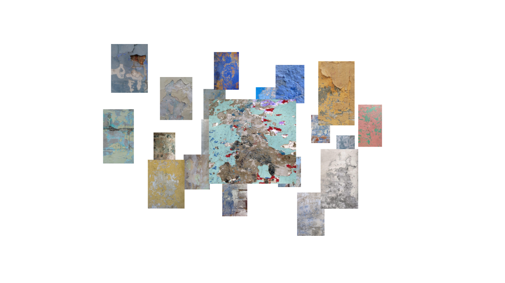

# 3Dgallery — a navigable 3D cloud of photographs

A 1:1 reconstruction of the **Foam Talent 2024** digital exhibition
([foam.org/talent-2024](https://www.foam.org/talent-2024)): photographs floating
in a 3D cloud you orbit through, with a typographic intro, hover states, a
camera flight into focus, and a background colour per work.

**Live:** https://acci4i0.github.io/3Dgallery/



> **Rebuild study.** Not affiliated with Foam, and not endorsed by them.
> Original concept and design © Foam Fotografiemuseum Amsterdam. No asset from
> the original site is included — images, fonts, code are all either mine or
> rebuilt from scratch. The photographs are my own, standing in for the
> exhibition's content.

## Stack

The same as the original site, verified against its production bundles:

- [three.js](https://threejs.org) r160 + [@react-three/fiber](https://github.com/pmndrs/react-three-fiber)
- [@react-three/drei](https://github.com/pmndrs/drei) (`OrbitControls`)
- [framer-motion](https://www.framer.com/motion/) 10.18 + framer-motion-3d
- [@use-gesture/react](https://use-gesture.netlify.app)
- Built with [Vite](https://vitejs.dev)

## Running it

```bash
npm install
npm run dev       # dev server
npm run build     # production build into dist/
npm run preview   # serve that build
```

## Changing the images

`public/img` is the single source of truth. Add, replace or remove
`.jpg`/`.png`/`.webp` files there and restart `npm run dev` (or re-run
`npm run build`). Before every dev and build, `npm run scan`
([scripts/scan-images.mjs](scripts/scan-images.mjs)) runs automatically and:

- normalises the files in place — EXIF orientation applied, resized to a
  2000 px maximum width, metadata stripped (GPS included);
- assigns images to the layout's 20 slots and picks the 8 intro slides with a
  deterministic shuffle, stable as long as the folder doesn't change; with
  fewer than 20 images some are reused, with more it picks 20;
- writes `src/gallery-images.generated.js` (gitignored) with dimensions and
  cache-busting URLs, so new images don't sit stale in the browser cache.

## Structure

```
gallery-data.js        the layout: 20 slots (position, colours, isPrimary,
                       reference CMS data) joined to the scanned images
public/img/            the photographs — single source of truth
scripts/scan-images.mjs  normalises images, generates the image→slot mapping
src/
  config.js            every behavioural constant, with its provenance
                       ([bundle] / [bundle-default] / [CMS])
  App.jsx              page: transparent canvas over an animated background
  Controls.jsx         OrbitControls plus the focus/unfocus camera flight
  Frame.jsx            cloud frame: billboard, hover, fades
  PrimaryFrame.jsx     primary frame: fullscreen slideshow, intro shrink
  IntroTypography.jsx  intro title
  CursorIcon.jsx       custom cursor in focus (× / "enter portfolio")
  Detail.jsx           caption of the focused frame
  debug-slides.js      numbered textures for checking the slideshow
                       (DEBUG_INTRO_SLIDES in config.js, false by default)
ANALYSIS.md            where every constant came from
docs/screenshot.png    the image above
```

## How it was made

Every numeric parameter — easings, durations, damping, scale factors,
positions — is extracted from the original site's JavaScript bundles or its
embedded data, never eyeballed, and then checked against the live behaviour.
The method and the values are written down in **[ANALYSIS.md](ANALYSIS.md)**.

## What is reproduced

The intro (typography, fullscreen slideshow at 250 ms per step, shrink into the
cloud), auto-rotate, damped orbit, dolly zoom, hover at 1.1 scale, focus with
camera flight and coloured background, the custom cursor, unfocus, and the fade
through to the portfolio. Mobile uses the reference's single 768 px breakpoint,
taken from its CSS: smaller intro type, a larger focus distance (factor 0.002),
a fixed × at the top and a "view this project" button instead of the custom
cursor. Out of scope: the original's filter mode and its artist pages.

One deliberate divergence: in focus the reference uses an editorial background
colour per artist, from its CMS. Here, with my own photographs, the colour is
derived from the image itself — average pixel value, highlight for contrast —
the automatic equivalent of a hand-curated choice
([src/extract-image-colors.js](src/extract-image-colors.js)).

## License

[MIT](LICENSE) © Andrea Lando ([Acci4i0](https://github.com/Acci4i0)).
Covers my code only — not the original design this study looks at.
